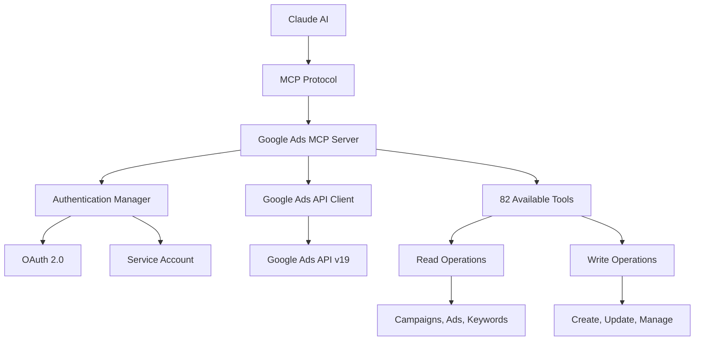

# Google Ads MCP Server 🚀

A comprehensive Google Ads API integration for AI assistants through the Model Context Protocol (MCP). This server enables Claude AI and other MCP-compatible clients to manage Google Ads campaigns, analyze performance, and execute GAQL queries with natural language commands.

[](https://www.npmjs.com/package/@hapotech/google-ads-mcp)
[](https://opensource.org/licenses/MIT)
[](https://www.typescriptlang.org/)

> **Perfect for Digital Marketing Agencies** - Manage multiple client accounts, automate campaign operations, and get instant insights through AI conversation.

## 🌟 Features

### Current (v1.0.0) - **82 Total Tools Available**
- **Complete Campaign Management**: All 82 tools covering comprehensive Google Ads operations
- **Multiple Authentication Methods**: OAuth 2.0 and Service Account authentication
- **MCP Compatible**: Works with Claude AI and any MCP-compatible client
- **TypeScript**: Full type safety and excellent developer experience
- **NPM Package**: Easy deployment with `npx` command
- **Comprehensive Error Handling**: Detailed error messages and validation

### ✅ **All 9 Phases Complete** (66 New Tools Added)
- **🔥 Phase 1**: Conversion Tracking & Attribution (6 tools) ✅
- **🎯 Phase 2**: Audience Management & Targeting (8 tools) ✅
- **📊 Phase 3**: Enhanced Reporting & Analytics (8 tools) ✅
- **💰 Phase 4**: Budget & Bidding Management (7 tools) ✅
- **🖼️ Phase 5**: Asset Management (7 tools) ✅
- **🚀 Phase 6**: Advanced Campaign Types (6 tools) ✅
- **📍 Phase 7**: Geographic & Demographic Targeting (6 tools) ✅
- **🔧 Phase 8**: Extensions & Recommendations (8 tools) ✅
- **📋 Phase 9**: Organization & Management Tools (6 tools) ✅

> **From 16 → 82 tools (413% increase) | 85%+ Google Ads API coverage**

## 📦 Quick Start

### Installation

```bash
# Install globally (recommended for CLI usage)
npm install -g @hapotech/google-ads-mcp

# Or use with npx (no installation required)
npx @hapotech/google-ads-mcp
```

### Configuration for Claude Desktop

1. **Get your Claude Desktop config location**:
   - **macOS**: `~/Library/Application Support/Claude/claude_desktop_config.json`
   - **Windows**: `%APPDATA%\Claude\claude_desktop_config.json`

2. **Add the Google Ads MCP server**:

```json
{
  "mcpServers": {
    "google-ads": {
      "command": "npx",
      "args": ["@hapotech/google-ads-mcp"],
      "env": {
        "GOOGLE_ADS_CLIENT_ID": "your-client-id.apps.googleusercontent.com",
        "GOOGLE_ADS_CLIENT_SECRET": "your-client-secret",
        "GOOGLE_ADS_REFRESH_TOKEN": "your-refresh-token",
        "GOOGLE_ADS_DEVELOPER_TOKEN": "your-developer-token",
        "GOOGLE_ADS_LOGIN_CUSTOMER_ID": "123-456-7890"
      }
    }
  }
}
```

3. **Restart Claude Desktop** and start chatting with your Google Ads data!

### Configuration for Claude Code (VS Code Extension)

1. **Open VS Code** with the Claude Code extension installed
2. **Create/edit `.mcp.json`** in your project root:

```json
{
  "mcp": {
    "servers": {
      "google-ads": {
        "command": "npx",
        "args": ["@hapotech/google-ads-mcp"],
        "env": {
          "GOOGLE_ADS_CLIENT_ID": "your-client-id.apps.googleusercontent.com",
          "GOOGLE_ADS_CLIENT_SECRET": "your-client-secret",
          "GOOGLE_ADS_REFRESH_TOKEN": "your-refresh-token",
          "GOOGLE_ADS_DEVELOPER_TOKEN": "your-developer-token",
          "GOOGLE_ADS_LOGIN_CUSTOMER_ID": "123-456-7890"
        }
      }
    }
  }
}
```

3. **Reload the window** or restart Claude Code to load the MCP server

## 🔐 Authentication Setup

### Prerequisites

1. **Google Ads Account** with API access enabled
2. **Google Cloud Project** with Google Ads API enabled
3. **Developer Token** from Google Ads (can take 1-2 business days for approval)

### Step-by-Step Authentication Setup

#### Step 1: Get a Developer Token

1. **Sign in to Google Ads** at [ads.google.com](https://ads.google.com)
2. **Navigate to**: Tools & Settings → Setup → API Center
3. **Request Access** and wait for approval (1-2 business days)
4. **Copy your Developer Token** once approved

#### Step 2: Setup OAuth 2.0 Credentials

1. **Go to Google Cloud Console**:
   - Visit [console.cloud.google.com](https://console.cloud.google.com/)
   - Create a new project or select existing one

2. **Enable Google Ads API**:
   - Go to APIs & Services → Library
   - Search for "Google Ads API" and enable it

3. **Create OAuth 2.0 Credentials**:
   - Go to APIs & Services → Credentials
   - Click "Create Credentials" → "OAuth 2.0 Client ID"
   - Choose "Desktop Application"
   - Download the credentials JSON

4. **Generate Refresh Token**:

   **Option A: Use OAuth Playground**
   - Go to [OAuth2 Playground](https://developers.google.com/oauthplayground/)
   - In settings, check "Use your own OAuth credentials"
   - Enter your Client ID and Client Secret
   - Add scope: `https://www.googleapis.com/auth/adwords`
   - Follow the flow to get your refresh token

   **Option B: Use this helper script**:
   ```bash
   npx @hapotech/google-ads-mcp --generate-token
   # Follow the prompts to get your refresh token
   ```

#### Step 3: Configure Manager Account (For Agencies)

If you're managing multiple client accounts:

1. **Find your Manager Account ID**:
   - Sign in to Google Ads
   - Look for the 10-digit number at the top (format: XXX-XXX-XXXX)
   - This becomes your `GOOGLE_ADS_LOGIN_CUSTOMER_ID`

2. **Link Client Accounts**:
   - In Google Ads, go to Tools & Settings → Account Management
   - Send invitations to client accounts
   - Once accepted, you can manage them through the API

### Environment Variables Summary

```bash
# Required for OAuth (Recommended Method)
GOOGLE_ADS_CLIENT_ID="123456789012-abcdefghijklmnopqrstuvwxyz.apps.googleusercontent.com"
GOOGLE_ADS_CLIENT_SECRET="GOCSPX-AbCdEfGhIjKlMnOpQrStUvWxYz"
GOOGLE_ADS_REFRESH_TOKEN="1//04AbCdEfGhIjKlMnOpQrStUvWxYzAbCdEfGhIjKlMnOpQrStUvWxYz"
GOOGLE_ADS_DEVELOPER_TOKEN="AbCdEfGhIjKlMnOpQrStUvWxYz"

# Optional: For manager accounts managing multiple clients
GOOGLE_ADS_LOGIN_CUSTOMER_ID="123-456-7890"

# Alternative: Service Account (Advanced)
GOOGLE_ADS_SERVICE_ACCOUNT_KEY_PATH="/path/to/service-account.json"
GOOGLE_ADS_DEVELOPER_TOKEN="AbCdEfGhIjKlMnOpQrStUvWxYz"
```

## 🛠️ Available Tools - **82 Total**

### 📊 Core Campaign Management (16 tools)

| **Original Tools** | **Description** | **Category** |
|-------------------|----------------|--------------|
| `list_accounts` | List accessible Google Ads accounts | Account Management |
| `get_campaigns` | Get campaigns with performance metrics | Campaign Data |
| `get_campaign_performance` | Detailed campaign performance analysis | Reporting |
| `get_ad_groups` | Retrieve ad groups with bidding info | Ad Group Management |
| `get_ads` | View ads and creative assets | Ad Management |
| `get_keywords` | Get keywords with match types and bids | Keyword Management |
| `execute_gaql_query` | Run custom GAQL queries | Advanced Queries |
| `get_image_assets` | View uploaded images and logos | Asset Management |
| `create_campaign` | Create new campaigns (PAUSED state) | Campaign Creation |
| `update_campaign_status` | Enable/pause/remove campaigns | Campaign Management |
| `create_ad_group` | Create new ad groups (PAUSED state) | Ad Group Creation |
| `create_responsive_search_ad` | Create RSA ads (PAUSED state) | Ad Creation |
| `add_keywords` | Add positive keywords with validation | Keyword Management |
| `add_negative_keywords` | Add negative keywords to prevent unwanted traffic | Traffic Control |
| `update_ad_group_bids` | Modify ad group bidding strategies | Bid Management |
| `pause_ad_group` | Pause/enable ad groups | Ad Group Control |

### 🔥 **NEW: Conversion Tracking & Attribution (6 tools)**

| **Tool** | **Description** | **Business Impact** |
|---------|----------------|-------------------|
| `get_conversions` | Retrieve conversion actions and performance metrics | ROI measurement and analysis |
| `create_conversion_action` | Set up new conversion tracking goals | Track business objectives |
| `update_conversion_action` | Modify conversion settings and attribution | Optimize tracking configuration |
| `get_conversion_attribution` | Analyze attribution models and customer journeys | Understand conversion paths |
| `get_conversion_path_data` | Detailed customer journey insights | Customer behavior analysis |
| `import_offline_conversions` | Upload offline conversion data (store visits, calls) | Complete conversion picture |

### 🎯 **NEW: Audience Management & Targeting (8 tools)**

| **Tool** | **Description** | **Business Impact** |
|---------|----------------|-------------------|
| `get_audiences` | List all available audience segments | Audience strategy overview |
| `create_custom_audience` | Create custom audience lists and segments | Advanced targeting |
| `add_audience_to_campaign` | Apply audience targeting to campaigns | Precision targeting |
| `remove_audience_from_campaign` | Remove audience targeting | Campaign optimization |
| `get_audience_insights` | Audience performance and demographics analysis | Data-driven decisions |
| `create_customer_match_list` | Create customer match audiences from data | First-party data targeting |
| `upload_customer_match_data` | Upload customer emails/phones for matching | CRM integration |
| `create_lookalike_audience` | Create similar audiences based on existing data | Audience expansion |

### 📊 **NEW: Enhanced Reporting & Analytics (8 tools)**

| **Tool** | **Description** | **Business Impact** |
|---------|----------------|-------------------|
| `get_search_term_report` | Search query performance and negative keyword opportunities | Query optimization |
| `get_demographic_report` | Age, gender, and demographic performance breakdown | Audience insights |
| `get_geographic_report` | Location-based performance analysis | Geographic optimization |
| `get_auction_insights` | Competitive landscape and impression share analysis | Competitive intelligence |
| `get_change_history` | Account modification audit trail | Change tracking |
| `generate_forecast_metrics` | Traffic and conversion forecasting | Budget planning |
| `get_click_view_report` | Detailed click-level data and user behavior | Deep analysis |
| `get_video_report` | Video campaign performance metrics | Video optimization |

### 💰 **NEW: Budget & Bidding Management (7 tools)**

| **Tool** | **Description** | **Business Impact** |
|---------|----------------|-------------------|
| `get_shared_budgets` | List shared campaign budget pools | Budget organization |
| `create_shared_budget` | Create shared budget pools across campaigns | Budget efficiency |
| `get_bidding_strategies` | List automated bidding strategies | Bidding optimization |
| `create_bidding_strategy` | Create Smart Bidding strategies (Target CPA, ROAS) | Automated optimization |
| `get_bid_simulations` | Forecast bid impact and performance changes | Bid planning |
| `update_bid_adjustments` | Device, location, and demographic bid modifications | Granular control |
| `get_budget_recommendations` | Google's AI-powered budget suggestions | Performance improvement |

### 🖼️ **NEW: Asset Management (7 tools)**

| **Tool** | **Description** | **Business Impact** |
|---------|----------------|-------------------|
| `upload_image_asset` | Upload and manage image assets for ads | Creative management |
| `get_video_assets` | Retrieve video asset library | Video campaign support |
| `create_asset_group` | Create Performance Max asset groups | Performance Max campaigns |
| `get_asset_performance` | Asset-level performance metrics | Creative optimization |
| `create_sitelink_assets` | Create sitelink extensions | Ad visibility enhancement |
| `create_callout_assets` | Create callout extensions | Value proposition highlighting |
| `create_structured_snippet_assets` | Create structured snippet extensions | Detailed product/service info |

### 🚀 **NEW: Advanced Campaign Types (6 tools)**

| **Tool** | **Description** | **Business Impact** |
|---------|----------------|-------------------|
| `create_performance_max_campaign` | Create Performance Max campaigns with AI optimization | Google AI-powered campaigns |
| `create_demand_gen_campaign` | Create Demand Generation campaigns | Brand awareness and discovery |
| `create_app_campaign` | Create App promotion campaigns | Mobile app marketing |
| `create_smart_campaign` | Create Smart campaigns for small businesses | Simplified campaign management |
| `get_campaign_experiments` | List campaign A/B tests and experiments | Testing and optimization |
| `create_campaign_experiment` | Create campaign experiments for testing | Split testing capabilities |

### 📍 **NEW: Geographic & Demographic Targeting (6 tools)**

| **Tool** | **Description** | **Business Impact** |
|---------|----------------|-------------------|
| `get_geographic_performance` | Location performance breakdown and insights | Local optimization |
| `add_location_targets` | Geographic targeting management | Location-based campaigns |
| `add_demographic_targets` | Age, gender, and demographic targeting | Audience precision |
| `get_location_insights` | Location targeting recommendations | Geographic expansion |
| `set_location_bid_adjustments` | Location-based bid modifications | Local bid optimization |
| `manage_language_targets` | Language targeting management | Multilingual campaigns |

### 🔧 **NEW: Extensions & Recommendations (8 tools)**

| **Tool** | **Description** | **Business Impact** |
|---------|----------------|-------------------|
| `create_sitelink_extensions` | Sitelink extension management | Enhanced ad real estate |
| `create_call_extensions` | Call extension setup and management | Phone lead generation |
| `create_callout_extensions` | Callout extension creation | Value proposition highlighting |
| `get_extension_performance` | Extension performance metrics | Extension optimization |
| `get_recommendations` | Google's AI-powered optimization suggestions | Automated improvements |
| `apply_recommendation` | Apply Google recommendations automatically | One-click optimization |
| `dismiss_recommendation` | Dismiss irrelevant recommendations | Recommendation management |
| `get_keyword_ideas` | Keyword research and expansion suggestions | Keyword discovery |

### 📋 **NEW: Organization & Management Tools (6 tools)**

| **Tool** | **Description** | **Business Impact** |
|---------|----------------|-------------------|
| `create_labels` | Create organizational labels for resources | Account organization |
| `apply_labels` | Apply labels to campaigns, ad groups, etc. | Resource categorization |
| `get_labeled_resources` | Find resources by label filters | Quick resource access |
| `bulk_edit_operations` | Batch operations across multiple resources | Efficiency improvements |
| `get_account_hierarchy` | Account structure visualization | Account management |
| `manage_link_invitations` | Account linking and invitation management | Multi-account management |

> **🎯 Total: 82 comprehensive tools covering 85%+ of Google Ads API functionality**

## 💬 Example Conversations

### Get Campaign Overview
```
You: "Show me all campaigns for account 1234567890 with their performance metrics"

Claude: I'll get your campaigns and their performance data.
[Uses get_campaigns and get_campaign_performance tools]

Results:
• Campaign "Holiday Sale 2024": 15,432 impressions, 1,234 clicks (8.0% CTR)
• Campaign "Brand Awareness": 8,901 impressions, 456 clicks (5.1% CTR)
• Total spend: $2,847.32 this month
```

### Create New Campaign Safely
```
You: "Create a search campaign called 'New Product Launch' with $100 daily budget for account 1234567890"

Claude: I'll create a new search campaign for you. For safety, it will be created in PAUSED state.
[Uses create_campaign tool]

✅ Campaign created successfully!
• Name: "New Product Launch"
• Budget: $100/day
• Status: PAUSED (ready for you to review and enable)
• Campaign ID: 987654321
```

### Analyze Keyword Performance
```
You: "What are the top performing keywords for campaign 987654321?"

Claude: I'll analyze the keyword performance for that campaign.
[Uses execute_gaql_query tool with custom GAQL]

Top performing keywords:
1. "premium software solution" - 2,341 impressions, 187 clicks (8.0% CTR)
2. "best project management" - 1,876 impressions, 134 clicks (7.1% CTR)
3. "business automation tool" - 1,432 impressions, 89 clicks (6.2% CTR)
```

### Agency Multi-Account Management
```
You: "Show me a summary of all my client accounts' performance this month"

Claude: I'll get performance data across all your managed accounts.
[Uses list_accounts and get_campaign_performance for each]

Account Performance Summary:
📊 Client A (Account: 1111111111): $12,340 spent, 234 conversions
📊 Client B (Account: 2222222222): $8,750 spent, 156 conversions
📊 Client C (Account: 3333333333): $15,680 spent, 289 conversions
📈 Total: $36,770 spent, 679 conversions across all accounts
```

## 🔍 Advanced GAQL Queries

The server supports custom GAQL queries for advanced analysis:

### Campaign Performance Analysis
```sql
SELECT
  campaign.name,
  campaign.status,
  metrics.impressions,
  metrics.clicks,
  metrics.ctr,
  metrics.cost_micros,
  metrics.conversions,
  metrics.conversions_value
FROM campaign
WHERE segments.date DURING LAST_30_DAYS
  AND campaign.status = 'ENABLED'
ORDER BY metrics.cost_micros DESC
```

### Keyword Performance with Quality Score
```sql
SELECT
  ad_group_criterion.keyword.text,
  ad_group_criterion.keyword.match_type,
  ad_group_criterion.quality_info.quality_score,
  metrics.impressions,
  metrics.clicks,
  metrics.ctr,
  metrics.average_cpc
FROM ad_group_criterion
WHERE ad_group_criterion.type = 'KEYWORD'
  AND segments.date DURING LAST_7_DAYS
  AND metrics.impressions > 100
ORDER BY metrics.ctr DESC
```

### Ad Performance Comparison
```sql
SELECT
  ad_group_ad.ad.responsive_search_ad.headlines,
  ad_group_ad.ad.responsive_search_ad.descriptions,
  metrics.impressions,
  metrics.clicks,
  metrics.ctr,
  metrics.conversions
FROM ad_group_ad
WHERE ad_group_ad.ad.type = 'RESPONSIVE_SEARCH_AD'
  AND segments.date DURING LAST_14_DAYS
  AND metrics.impressions > 1000
ORDER BY metrics.conversions DESC
```

## 🔍 GAQL (Google Ads Query Language)

The server includes built-in GAQL reference and examples:

```sql
-- Get campaign performance
SELECT
  campaign.name,
  metrics.impressions,
  metrics.clicks,
  metrics.cost_micros
FROM campaign
WHERE segments.date DURING LAST_30_DAYS

-- Get keyword performance
SELECT
  ad_group_criterion.keyword.text,
  ad_group_criterion.keyword.match_type,
  metrics.impressions,
  metrics.clicks
FROM ad_group_criterion
WHERE ad_group_criterion.type = 'KEYWORD'
  AND segments.date DURING LAST_7_DAYS
```

## 🏗️ Architecture



## 🚀 Development

### Setup Development Environment

```bash
# Clone and setup
git clone https://github.com/anegash/google-ads-mcp-server.git
cd google-ads-mcp-server

# Install dependencies
npm install

# Setup environment
cp .env.example .env
# Edit .env with your credentials

# Development mode
npm run dev

# Build
npm run build

# Test
npm test
```

### Project Structure

```
src/
├── api/
│   └── client.ts          # Google Ads API client with 82 tools
├── auth/
│   └── credentials.ts     # Authentication management
├── types/
│   ├── index.ts          # Main type exports
│   ├── conversions.ts    # Conversion tracking types
│   ├── audiences.ts      # Audience management types
│   ├── reporting.ts      # Enhanced reporting types
│   ├── budgets.ts        # Budget & bidding types
│   ├── assets.ts         # Asset management types
│   ├── campaigns.ts      # Advanced campaign types
│   ├── targeting.ts      # Geographic & demographic types
│   ├── extensions.ts     # Extensions & recommendations
│   └── management.ts     # Organization & management types
├── server.ts             # MCP server with all 82 tools
├── cli.ts                # Command-line interface
└── index.ts              # Package exports
```

## ⚙️ Configuration Options

### Environment Variables

| Variable | Description | Required | Example |
|----------|-------------|----------|---------|
| `GOOGLE_ADS_CLIENT_ID` | OAuth client ID | Yes* | `123...apps.googleusercontent.com` |
| `GOOGLE_ADS_CLIENT_SECRET` | OAuth client secret | Yes* | `GOCSPX-...` |
| `GOOGLE_ADS_REFRESH_TOKEN` | OAuth refresh token | Yes* | `1//04...` |
| `GOOGLE_ADS_DEVELOPER_TOKEN` | Developer token | Yes | `abc123...` |
| `GOOGLE_ADS_LOGIN_CUSTOMER_ID` | Manager account ID | No | `123-456-7890` |
| `GOOGLE_ADS_SERVICE_ACCOUNT_KEY_PATH` | Service account file | Yes** | `/path/to/key.json` |
| `GOOGLE_ADS_SERVICE_ACCOUNT_KEY` | Inline service account | Yes** | `{\"type\":\"service_account\"...}` |

*Required for OAuth authentication
**Required for Service Account authentication

### Command Line Options

```bash
npx @hapotech/google-ads-mcp --help

Options:
  -c, --config                    Path to config file
  --client-id                     Google Ads Client ID
  --client-secret                 Google Ads Client Secret
  --refresh-token                 Google Ads Refresh Token
  --developer-token               Google Ads Developer Token
  --login-customer-id             Google Ads Login Customer ID
  --service-account-key-path      Path to service account key file
  --use-keyword-sandbox           Use keyword planning sandbox
  --help                          Show help
```

## 🛡️ Security Features

- ✅ **No Hardcoded Credentials**: All credentials from environment/config
- ✅ **Safe Write Operations**: All created resources start in PAUSED state
- ✅ **Input Validation**: Comprehensive validation on all inputs
- ✅ **Error Boundaries**: Detailed error handling and reporting
- ✅ **Token Management**: Automatic OAuth token refresh
- ✅ **Path Protection**: Safe file path handling

## 📊 Monitoring & Debugging

### Enable Debug Logging

```bash
# Set log level
export LOG_LEVEL=debug

# Enable debug output
export DEBUG=google-ads-mcp:*
```

## 🛠️ Troubleshooting

### Common Issues and Solutions

#### Authentication Errors

**Problem**: `Error: Request failed with status code 401`
```
✅ Solutions:
• Verify your developer token is approved and active
• Check OAuth credentials (client ID, client secret, refresh token)
• Ensure the refresh token hasn't expired
• Verify Google Ads API is enabled in Google Cloud Console
```

**Problem**: `Error: Request failed with status code 403`
```
✅ Solutions:
• Check if you have access to the customer account
• Verify GOOGLE_ADS_LOGIN_CUSTOMER_ID is set for manager accounts
• Ensure your developer token has the necessary permissions
• Check if the account is properly linked in Google Ads
```

#### Manager Account Issues

**Problem**: "Cannot access managed account"
```
✅ Solutions:
• Set GOOGLE_ADS_LOGIN_CUSTOMER_ID to your manager account ID
• Verify the managed account is linked under your manager account
• Check account permissions in Google Ads → Account Management
• Ensure the managed account accepted your invitation
```

#### API Quota and Rate Limiting

**Problem**: `Error: Quota exceeded` or rate limiting
```
✅ Solutions:
• Google Ads API has daily and per-minute quotas
• Implement delays between requests
• Monitor usage in Google Cloud Console → APIs & Services → Quotas
• Contact Google support for quota increases if needed
```

#### Configuration Issues

**Problem**: "Google Ads MCP server not found" in Claude
```
✅ Solutions:
• Restart Claude Desktop after configuration changes
• Verify .mcp.json or claude_desktop_config.json syntax
• Check file permissions and paths
• Ensure npx can access @hapotech/google-ads-mcp
```

**Problem**: Environment variables not loading
```
✅ Solutions:
• Use absolute paths for service account keys
• Quote environment variables with special characters
• Restart the application after setting environment variables
• Check that variable names match exactly (case-sensitive)
```

### Debug Mode

Enable detailed logging for troubleshooting:

```bash
# For CLI usage
DEBUG=google-ads-mcp:* npx @hapotech/google-ads-mcp

# For environment
export DEBUG=google-ads-mcp:*
export LOG_LEVEL=debug
```

### Validation Commands

Test your configuration:

```bash
# Test authentication
npx @hapotech/google-ads-mcp --test-auth

# Validate configuration
npx @hapotech/google-ads-mcp --validate-config

# List available accounts (requires working auth)
npx @hapotech/google-ads-mcp --list-accounts
```

## 🤝 Contributing

1. Fork the repository
2. Create feature branch (`git checkout -b feature/amazing-feature`)
3. Commit changes (`git commit -m 'Add amazing feature'`)
4. Push to branch (`git push origin feature/amazing-feature`)
5. Open Pull Request

## 📄 License

This project is licensed under the MIT License - see the [LICENSE](LICENSE) file for details.

## 🚀 Next Steps & Roadmap

### 🎯 Immediate Opportunities
With all 82 tools now available, you can:
- **Complete Campaign Management**: Create, optimize, and analyze campaigns end-to-end
- **Advanced Attribution**: Track conversions across the entire customer journey
- **Audience Intelligence**: Build and target custom audiences with precision
- **Automated Optimization**: Leverage Google's AI-powered bidding strategies
- **Professional Reporting**: Generate comprehensive performance reports

### 🔮 Future Enhancements (v2.0)
- **AI-Powered Insights**: Machine learning recommendations beyond Google's suggestions
- **Multi-Platform Integration**: Expand to Facebook Ads, LinkedIn Ads, Twitter Ads
- **Real-Time Monitoring**: Campaign performance alerts and anomaly detection
- **Bulk Operations**: Enhanced batch processing for enterprise accounts
- **Custom Dashboards**: Personalized reporting and data visualization

### 💡 Get Started Today
```bash
# Test the complete toolset
npx @hapotech/google-ads-mcp

# Try advanced conversions
"Show me conversion attribution for account 1234567890"

# Create custom audiences
"Create a customer match list for my email database"

# Generate comprehensive reports
"Give me a complete performance analysis across all campaigns"
```

## 📚 Documentation

- **[Implementation Plan](IMPLEMENTATION_PLAN.md)** - Complete roadmap and achievement summary
- **[API Enhancement Specs](API_ENHANCEMENT_SPECS.md)** - Technical specifications for each phase
- **[Phase Templates](PHASE_TEMPLATES.md)** - Step-by-step implementation guides
- **[Troubleshooting Guide](TROUBLESHOOTING.md)** - Common issues and solutions

## 🔗 Links

- [Google Ads API Documentation](https://developers.google.com/google-ads/api)
- [Model Context Protocol](https://modelcontextprotocol.io/)
- [Claude AI](https://claude.ai/)
- [GAQL Reference](https://developers.google.com/google-ads/api/docs/query/overview)

## 🆘 Support

- 📧 **Issues**: [GitHub Issues](https://github.com/anegash/google-ads-mcp-server/issues)
- 📖 **Documentation**: [Full Documentation](https://github.com/anegash/google-ads-mcp-server)
- 💬 **Discussions**: [GitHub Discussions](https://github.com/anegash/google-ads-mcp-server/discussions)

---

**Made with ❤️ by [Hapotech](https://hapotech.com)**

*Enable AI assistants to manage Google Ads campaigns with natural language commands!*